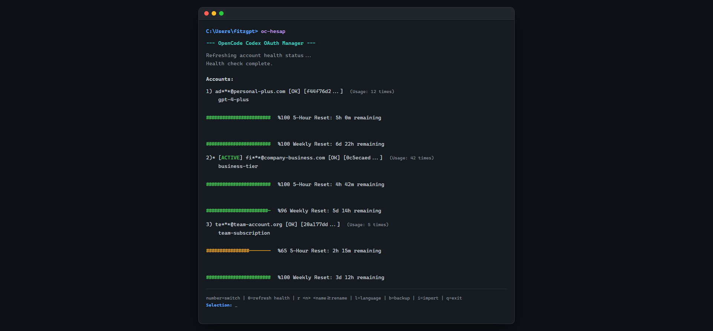

# 🌐 [English](./README.md) | [Türkçe](./README_TR.md)

# 🚀 opencode-codex-oauth-manager



> **"Built to make the OpenCode experience even more practical and seamless."**

I originally developed **opencode-codex-oauth-manager** to streamline my own workflow while managing multiple **OpenAI Plus, Team, or Business** accounts within [OpenCode](https://github.com/opencode). I decided to share it with the community, hoping it might be useful for others who deal with similar setups.

---

## ⚡ At a Glance: Why It’s Critical

Managing several high-tier accounts manually is a productivity killer. Here’s why this tool is your new unfair advantage:

- **🔥 Zero-Friction Switching:** Swap active accounts in under 2 seconds. No config file editing, no logout/login loops.
- **⚡ Instant Apply:** **No restart required!** Changes apply to OpenCode in real-time. Just switch and keep working.
- **📊 Real-Time Quota Intel:** Don't guess. On every startup, it pings OpenAI to show you exactly how many messages you have left and the precise reset time.
- **🧠 Smart Auto-Sync:** It automatically detects your active OpenCode account and securely clones it into your local database.
- **🛡️ Use Responsibly:** This tool is built for productivity. **Please do not abuse the system.**
- **💎 Pro Support:** Perfect for **Pro** account users too. (And if you actually manage to finish your Pro quota, hats off to you! 😄)

---

## 🔥 Why It's a Game Changer

If you're an OpenCode power user, this is your new unfair advantage:

- **🚀 Speed:** Switch between personal and business accounts faster than you can type a message.
- **📉 Transparency:** See your 5-hour and weekly limits in color-coded ASCII bars.
- **📈 Insights:** Track usage statistics to see which accounts are providing the most value.
- **💾 Portability:** Easily backup your entire account repository and move it to another machine.
- **🌍 Universal:** Native, high-performance support for **Windows, Linux, and macOS**.

---

## 🛠️ Features That Actually Matter

- **Interactive Command Center:** A sleek, intuitive menu for renames, health checks, and switching.
- **Auto-Health Check:** Optional automatic refresh on startup so you're always working with fresh data.
- **Account Labeling:** Give your accounts human names like `Company-Business` or `Backup-Plus-2`.
- **i18n Ready:** Dynamic auto-detection for English and Turkish languages.
- **Local-First Security:** Your tokens stay on your machine. We never touch your secrets.
- **OpenCode Sidebar Plugin (NEW):** Includes an optional TUI sidebar panel with quick account switching, compact quota view, refresh control, auto-refresh toggle, and saved UI preferences.

---

## 🚀 Quick Start & Installation

### Prerequisites
- [Node.js](https://nodejs.org/) (v18 or higher)

### Setup
1. **Clone the repository:** 
   ```bash
   git clone https://github.com/fitzgpt/opencode-codex-oauth-manager.git
   cd opencode-codex-oauth-manager
   ```
2. **Run the One-Click Installer:**
   - **Windows:** Double-click `install.bat`.
   - **Linux/macOS:** `chmod +x install.sh && ./install.sh`.
3. **Launch:** Type `oc-hesap` in any terminal.

---

## 🎮 Interactive Commands

Forget about complex flags. Manage everything with single keystrokes:

- **`[Number]`**: Instantly switch to that account.
- **`0`**: Force a manual refresh of all account health/quotas.
- **`r [N] [Name]`**: Rename account number `N` to a custom name.
- **`l`**: Toggle interface language (English/Turkish).
- **`b`**: Create a timestamped backup of your account database.
- **`i`**: Import an existing backup file.
- **`q`**: Exit the manager.

---

## 🧩 Optional Sidebar Plugin

This repository now includes an OpenCode TUI sidebar plugin at `plugin/oc-hesap-sidebar`.

What it provides:

- Compact quota panel with status badge (`OK`, `MID`, `LOW`, `ERR`)
- Manual refresh with cooldown indicator
- Auto-refresh toggle
- Accordion account list with one-click account switching
- Preferences persistence (`panel`, `accounts`, `auto refresh`) via OpenCode KV

Quick setup (global OpenCode config):

1. Ensure your OpenCode config directory has plugin dependencies:

```bash
cd ~/.config/opencode
bun add @opentui/solid solid-js
```

2. Add this to `~/.config/opencode/tui.json`:

```json
{
  "$schema": "https://opencode.ai/tui.json",
  "plugin": [
    ["file:///ABSOLUTE/PATH/TO/opencode-codex-oauth-manager/plugin/oc-hesap-sidebar", { "refreshMs": 30000 }]
  ]
}
```

3. Restart OpenCode.

---

## ➕ How to Add New Accounts

Adding accounts is 100% automated and friction-free:

1. Open **OpenCode**.
2. Type `/connect` and select **OpenAI**.
3. Log in to your new account.
4. Run `oc-hesap`.
5. **Boom!** The new account is detected and added to your list automatically.

---

## 🗺️ 2026 Roadmap

### **Phase 1: Foundations (Completed) ✅**
- [x] **Modular Architecture:** Professional code structure for high stability.
- [x] **Cross-Platform Support:** Native installers for all OS.
- [x] **Auto-Sync:** Automatic detection of new OpenCode logins.
- [x] **Usage Statistics:** Tracking account usage counts.
- [x] **i18n Support:** Dynamic English/Turkish toggle.
- [x] **Backup System:** Export/Import functionality.

### **Phase 2: Power & Security (In Progress) 🏗️**
- [ ] **Master Password:** AES-256 encryption for stored tokens.
- [ ] **Parallel Checks:** Refresh all account statuses simultaneously.
- [ ] **Manual Management:** Add/Remove accounts via CLI directly.

### **Phase 3: The Future (Coming Soon) 🌟**
- [ ] **TUI Dashboard:** A fully graphical terminal interface.
- [ ] **Desktop Notifications:** Alerts when your quota resets.
- [ ] **Cloud Sync:** Securely sync across multiple devices.

---

## 🤝 Acknowledgments & Community

Special thanks to the **OpenCode** team for building such an incredible ecosystem.

### Stay Connected
Follow the journey and get the latest updates on Twitter:
👉 **[@FitzGPT](https://x.com/FitzGPT)**

---

## 📄 License
Licensed under the [MIT License](./LICENSE).
